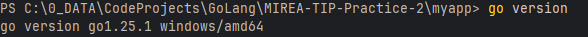
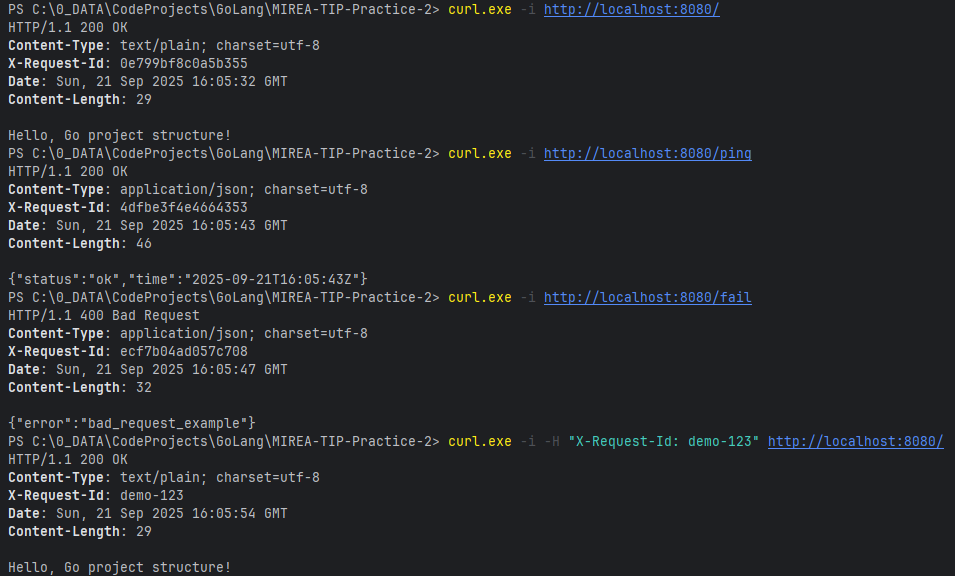
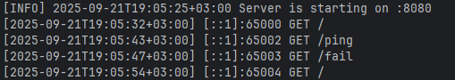
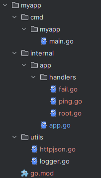

# Практическая работа №2
## Выполнил: Туев Д. ЭФМО - 01

# Описание проекта
Данный проект предназначен для изучения основ построения структуры приложений, разрабатываемых на Go  
# Требования к проекту
- Предусмотрена возможность свободного клонирования с Git
- Сборка и компиляция выполняется успешно
- При обращении к handler'у в консоли пишутся логи
# Для разработчика
## Версия
Версия Go в проекте используется следующая:


## Сборка
Для сборки проекта необходимо выполнить команду из директории myapp:
```
go build -o executableFileName.exe ./cmd/myapp/main.go
```
## Запуск
Для запуска без компиляции выполняется команда из директории myapp:
```
go run ./cmd/myapp/main.go
```

## Проверка работоспоcобности
Для проверки работоспособности необходимо обратиться к разворачиваемому API с помощью следующего примера:


При таком порядке запросов логи будут следующие:


# Структура проекта

